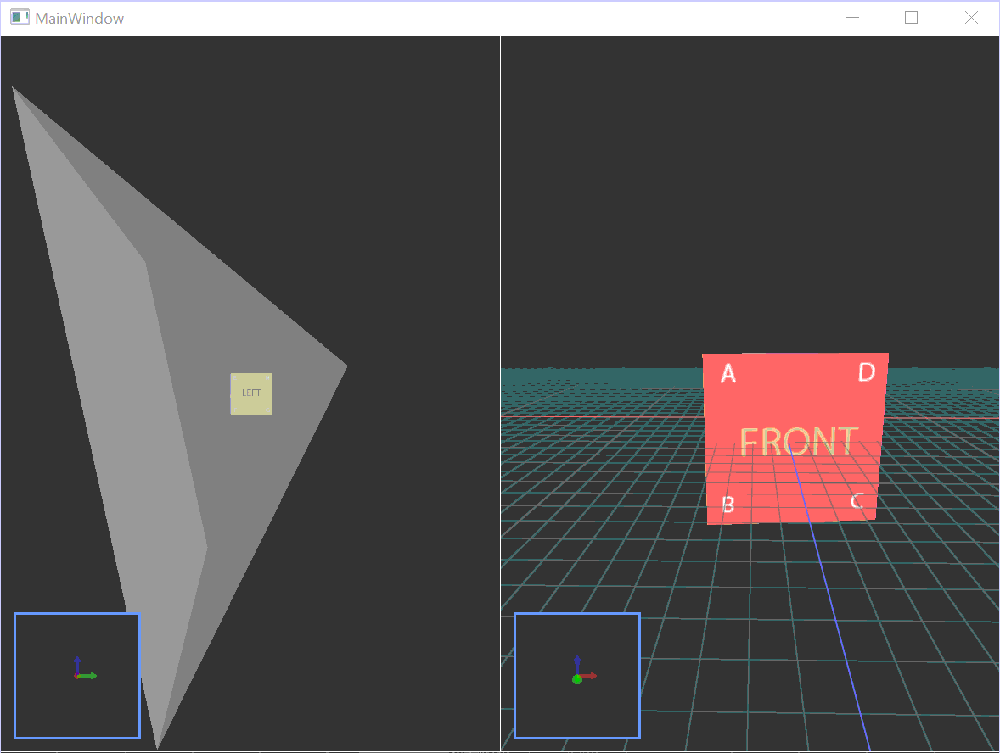

# Actor and Observer 3D Views

This WPF application uses [OpenTK](https://opentk.net/)'s to render a simple 3D scene that consists of a rotating cube in origin. It uses 2 [GLWpfControl](https://github.com/opentk/GLWpfControl) instances to render the scene from 2 perspectives:
- The actor view - in this one, the user has control over the camera and can freely move it in the 3D world
- The observer view - is a static perspective that shows how the actor moves in the world and highlights the area visible to the camera.

